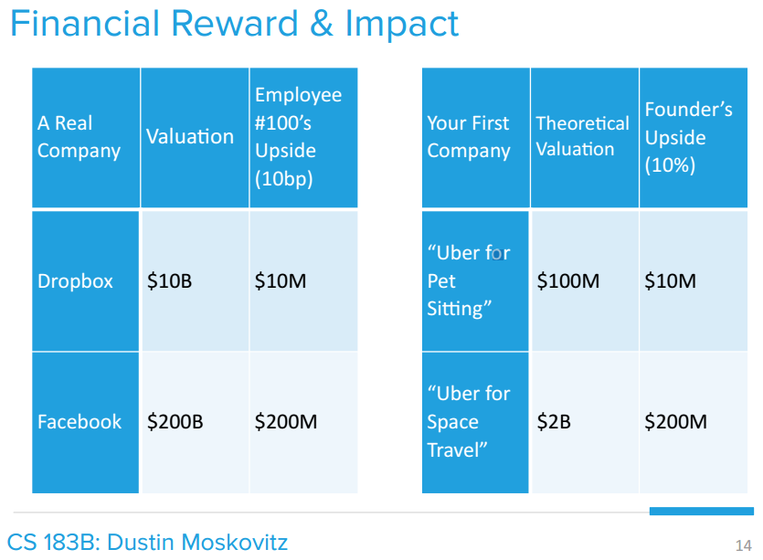

[Source](https://www.youtube.com/watch?v=CBYhVcO4WgI)





# How to Start a Startup

Welcome to CS183B. I am Sam Altman, I'm the President of Y Combinator. Nine years ago, I was a Stanford student, and then I dropped out to start a company and then I've been an investor for the last few. So YC, we've been teaching people how to start startups for nine years. Most of it's pretty specific to the startups but thirty percent of it is pretty generally applicable. And so we think we can teach that thirty percent in this class. And even though that's only thirty percent of the way there, hopefully it will still be really helpful.

We've taught a lot of this class at YC and it's all been off the record. And this is the first time a lot of what we teach is going to be on the record. We've invited some of our guest speakers to come and give the same talks they give at YC. We've now funded 725 companies and so we're pretty sure a lot of this advice we give is pretty good. We can't fund every startup yet, but we can hopefully make this advice very generally available.

I'm only teaching three. Counting YC itself, every guest speaker has been involved in the creation of a billion plus dollar company. So the advice shouldn't be that theoretical, it's all been people who have done it.

All of the advice in this class is geared towards people starting a business where the goal is hyper growth and eventually building a very large company. Much of it doesn't apply in other cases and I want to warn people up front, that if you try to do these things in a lot of big companies or non-startups, it won't work. It should still be interesting, I really think that startups are the way of the future and it's worth trying to understand them, but startups are very different than normal companies. So over the course of today and Thursday, I'm going to try to give an overview of the four areas you need to excel at in order to maximize your success as a startup. And then throughout the course, the guest speakers are going to drill into all of these in more detail.

## Ideas, Products, Teams and Execution Part I

So the four areas: You need a great idea, a great product, a great team, and great execution. These overlap somewhat, but I'm going to have to talk about them somewhat individually to make it make sense.

You may still fail. The outcome is something like idea x product x execution x team x luck, where luck is a random number between zero and ten thousand. Literally that much. But if you do really well in the four areas you can control, you have a good chance at at least some amount of success.

One of the exciting things about startups is that they are a surprisingly even playing field. Young and inexperienced, you can do this. Old and experienced, you can do this, too. And one of the things that I particularly like about startups is that some of the things that are bad in other work situations, like being poor and unknown, are actually huge assets when it comes to starting a startup.

Before we jump in on the how, I want to talk about why you should start a startup. I'm somewhat hesitant to be doing this class at all because you should never start a startup just for the sake of doing so. There are much easier ways to become rich and everyone who starts a startup always says, always, that they couldn't have imagined how hard and painful it was going to be. You should only start a startup if you feel compelled by a particular problem and that you think starting a company is the best way to solve it.

The specific passion should come first, and the startup second. In fact, all of the classes we have at YC follow this. So for the second half of today's lecture, Dustin Moskovitz is going to take over and talk about why to start a startup. We were so surprised at the amount of attention this class got, that we wanted to make sure we spent a lot of time on the why.

The first of the four areas: a great idea. It's become popular in recent years to say that the idea doesn't matter. In fact, it's uncool to spend a lot of time thinking about the idea for a startup. You're just supposed to start, throw stuff at the wall, see what sticks, and not even spend any time thinking about if it will be valuable if it works.

And pivots are supposed to be great, the more pivots the better. So this isn't totally wrong, things do evolve in ways you can't totally predict. And there's a limit to how much you can figure out without actually getting a product in the hands of the users. And great execution is at least ten times as important and a hundred times harder than a great idea.

But the pendulum has swung way out of whack. A bad idea is still bad and the pivot-happy world we're in today feels suboptimal. Great execution towards a terrible idea will get you nowhere. There are exceptions, of course, but most great companies start with a great idea, not a pivot.

If you look at successful pivots, they almost always are a pivot into something the founders themselves wanted, not a random made up idea. Airbnb happened because Brian Chesky couldn't pay his rent, but he had some extra space. In general though if you look at the track record of pivots, they don't become big companies. I myself used to believe ideas didn't matter that much, but I'm very sure that's wrong now.

The definition of the idea, as we talk about it, is very broad. It includes the size and the growth of the market, the growth strategy for the company, the defensibility strategy, and so on. When you're evaluating an idea, you need to think through all these things, not just the product. If it works out, you're going to be working on this for ten years so it's worth some real up front time to think through the up front value and the defensibility of the business. Even though plans themselves are worthless, the exercise of planning is really valuable and totally missing in most startups today.
Long-term thinking is so rare anywhere, but especially in startups. There is a huge advantage if you do it. Remember that the idea will expand and become more ambitious as you go. You certainly don't need to have everything figured out in your path to world domination, but you really want a nice kernel to start with. You want something that can develop in interesting ways.

As you're thinking through ideas, another thing we see that founders get wrong all the time is that someday you need to build a business that is difficult to replicate. This is an important part of a good idea.

I want to make this point again because it is so important: the idea should come first and the startup should come second. Wait to start a startup until you come up with an idea you feel compelled to explore. This is also the way to choose between ideas. If you have several ideas, work on the one that you think about most often when you're not trying to think about work. What we hear again and again from founders is that they wish they had waited until they came up with an idea they really loved.

Another way of looking at this is that the best companies are almost always mission oriented. It's difficult to get the amount of focus that large companies need unless the company feels like it has an important mission. And it's usually really hard to get that without a great founding idea. A related advantage of mission oriented ideas is that you yourself will be dedicated to them. It takes years and years, usually a decade, to build a great startup. If you don't love and believe in what you're building, you're likely to give up at some point along the way. There's no way I know of to get through the pain of a startup without the belief that the mission really matters. A lot of founders, especially students, believe that their startups will only take two to three years and then after that they'll work on what they're really passionate about. That almost never works. Good startups usually take ten years.

A third advantage of mission oriented companies is that people outside the company are more willing to help you. You'll get more support on a hard, important project, than a derivative one. When it comes to starting a startup, it's easier to found a hard startup than an easy startup. This is one of those counter-intuitive things that takes people a long time to understand. It's difficult to overstate how important being mission driven is, so I want to state it one last time: derivative companies, companies that copy an existing idea with very few new insights, don't excite people and they don't compel the teams to work hard enough to be successful.

Paul Graham is going to talk about how to get startup ideas next week. It's something that a lot of founders struggle with, but it's something I believe you can get better at with practice and it's definitely worth trying to get better at.

The hardest part about coming up with great ideas, is that the best ideas often look terrible at the beginning. The thirteenth search engine, and without all the features of a web portal? Most people thought that was pointless. Search was done, and anyways, it didn't matter that much. Portals were where the value was at. The tenth social network, and limited only to college students with no money? Also terrible. MySpace has won and who wants college students as customers? Or a way to stay on strangers' couches. That just sounds terrible all around.

These all sounded really bad but they turned out to be good. If they sounded really good, there would be too many people working on them. As Peter Thiel is going to discuss in the fifth class, you want an idea that turns into a monopoly. But you can't get a monopoly right away. You have to find a small market in which you can get a monopoly and then quickly expand. This is why some great startup ideas look really bad at the beginning. It's good if you can say something like, "Today, only this small subset of users are going to use my product, but I'm going to get all of them, and in the future, almost everyone is going to use my product."

Here is the theme that is going to come up a lot: you need conviction in your own beliefs and a willingness to ignore others' naysaying. The hard part is that this is a very fine line. There's right on one side of it, and crazy on the other. But keep in mind that if you do come up with a great idea, most people are going to think it's bad. You should be happy about that, it means they won't compete with you.

This also another reason why it's not really dangerous to tell people your idea. The truly good ideas don't sound like they're worth stealing. You want an idea where you can say, "I know it sounds like a bad idea, but here's specifically why it's actually a great one." You want to sound crazy, but you want to actually be right. And you want an idea that not many other people are working on. And it's okay if it doesn't sound big at first.

A common mistake among founders, especially first time founders, is that they think the first version of their product - the first version of their idea - needs to sound really big. But it doesn't. It needs to take over a small specific market and expand from there. That's how most great companies get started. Unpopular but right is what you're going for. You want something that sounds like a bad idea, but is a good idea.

You also really want to take the time to think about how the market is going to evolve. You need a market that's going to be big in 10 years. Most investors are obsessed with the market size today, and they don't think at all about how the market is going to evolve.

In fact, I think this is one of the biggest systemic mistakes that investors make. They think about the growth of the start-up itself, they don't think about the growth of the market. I care much more about the growth rate of the market than its current size, and I also care if there's any reason it's going to top out. You should think about this. I prefer to invest in a company that's going after a small, but rapidly growing market, than a big, but slow-growing market.
One of the big advantages of these sorts of markets - these smaller, rapidly growing markets - is that customers are usually pretty desperate for a solution, and they'll put up with an imperfect, but rapidly improving product. A big advantage of being a student - one of the two biggest advantages - is that you probably have better intuition about which markets are likely to start growing rapidly than older people do. Another thing that students usually don't understand, or it takes awhile, [is that] you can not create a market that does not want to exist. You can basically change everything in a start-up but the market, so you should actually do some thinking to be sure - or be as sure as you can be - that the market you're going after is going to grow and be there.

There are a lot of different ways to talk about the right kind of market. For example, surfing some one else's wave, stepping into an up elevator, or being part of a movement, but all of this is just a way of saying that you want a market that's going to grow really quickly. It may seem small today, it may be small today, but you know - and other people don't - that it's going to grow really fast.

So think about where this is happening in the world. You need this sort of tailwind to make a startup successful.

The exciting thing is the there are probably more of these tailwinds now then ever before. As Marc Andreessen says, software is eating the world. Its just everywhere, there are so many great ideas out there. You just have to pick one, and find one that you really care about.

Another version of this, that gets down to the same idea, is Sequoia's famous question: Why now? Why is this the perfect time for this particular idea, and to start this particular company. Why couldn't it be done two years ago, and why will two years in the future be too late? For the most successful startups we've been involved with, they've all had a great idea and a great answer to this question. And if you don't you should be at least somewhat suspicious about it.

In general, its best if you're building something that you yourself need. You'll understand it much better than if you have to understand it by talking to a customer to build the very first version. If you don't need it yourself, and you're building something someone else needs, realize that you're at a big disadvantage, and get very very close to your customers. Try to work in their office, if you can, and if not, talk to them multiple times a day.

Another somewhat counterintuitive thing about good startup ideas is that they're almost always very easy to explain and very easy to understand. If it takes more then a sentence to explain what you're doing, that's almost always a sign that its too complicated. It should be a clearly articulated vision with a small number of words. And the best ideas are usually very different from existing companies, [either] in one important way, like Google being a search engine that worked just really well, and none of the other stuff of the portals, or totally new, like SpaceX. Any company that's a clone of something else, that already exists, with some small or made up differentiator—like X, beautiful design, or Y for people that like red wine instead—that usually fails.

So as I mentioned, one of the great things about being a student is that you've got a very good perspective on new technology. And learning to have good ideas takes a while, so start working on that right now. That's one thing we hear from people all the time, that they wish they had done more of as a student.

The other is meeting potential cofounders. You have no idea how good of an environment you're in right now, for meeting people you can start a company with down the road. And the one thing that we always tell college students is that more important then any particular startup is getting to know potential cofounders.

So I want to finish this section of my talk with a quote from 50 Cent. This is from when he was asked about Vitamin Water. I won't read it, it's up there, but it's about the importance of thinking about what customers want, and thinking about the demands of the market. Most people don't do this—most students especially don't do this. If you can just do this one thing, if you can just learn to think about the market first, you'll have a big leg up on most people starting startups. And this is probably the thing we see wrong with Y Combinator apps most frequently, is that people have not thought about the market first, and what people want first.

So for the next section, I'm going to talk about building a great product. And here, again, I'm going to use a very broad definition of product. It includes customer support, the copy you write explaining the product, anything involved in your customer's interaction in what you built for them.

To build a really great company, you first have to turn a great idea into a great product. This is really hard, but its crucially important, and fortunately its pretty fun. Although great products are always new to the world, and its hard to give you advice about what to build, there are enough commonalities that we can give you a lot of advice about how to build it.

One of the most important tasks for a founder is to make sure that the company builds a great product. Until you build a great product, nothing else matters. When really successful startup founders tell the story of their early days its almost always sitting in front of the computer working on their product, or talking to their customers. That's pretty much all the time. They do very little else, and you should be very skeptical if your time allocation is much different. Most other problems that founders are trying to solve, raising money, getting more press, hiring, business development, et cetera, these are significantly easier when you have a great product. Its really important to take care of that first. Step one is to build something that users love. At YC, we tell founders to work on their product, talk to users, exercise, eat and sleep, and very little else. All the other stuff I just mentioned—PR, conferences, recruiting advisers, doing partnerships—you should ignore all of that, and just build a product and get it as good as possible by talking to your users.
Your job is to build something that users love. Very few companies that go on to be super successful get there without first doing this. A lot of good-on-paper startups fail because they merely make something that people like. Making something that people want, but only a medium amount, is a great way to fail, and not understand why you're failing. So these are the two jobs

Something that we say at YC a lot is that its better to build something that a small number of users love, then a large number of users like. Of course, it would be best to build something that a small number of users love, but opportunities to do that for v1 are rare, and they're usually not available to startups. So in practice you end up choosing the gray or the orange. You make something that a lot of users like a little bit, or something that a small number of users love a lot. This is a very important piece of advice. Build something that a small number of users love. It is much easier to expand from something that small number of people love, to something that a lot of people love, then from something that a lot of people like to a lot of people love. If you get right, you can get a lot of other things wrong. If you don't get this right, you can get everything else right, and you'll probably still fail. So when you start on the startup, this is the only thing you need to care about until its working.

[Audience member]: Can you go over that slide again?

So you have a choice in a startup. The best thing of all worlds is to build a product that a lot of people really love. In practice, you can't usually do that, because if there's an opportunity like that, Google or Facebook will do it. So there's like a limit to the area under the curve, of what you can build. So you can build something that a large number of users like a little bit, or a small number of users love a lot. So like the total amount of love is the same, its just a question of how its distributed. [audience laughter] And there's like this law of conservation of how much happiness you can put in the world, with the first product of a startup.

And so startups always struggle, with which of those two they should go. And they seem equal, right? Because the area under the curve is the same. But we've seen this time and again, that they're not. And that it's so much easier to expand, once you've got something that some people love, you can expand that into something that a lot of other people love. But if you start with ambivalence, or weak enthusiasm, and try to expand that, you'll never get up to a lot of people loving it. So the advice is: find a small group of users, and make them love what you're doing

One way that you know when this is working, is that you'll get growth by word of mouth. If you get something people love, people will tell their friends about it. This works for consumer product and enterprise products as well. When people really love something, they'll tell their friends about it, and you'll see organic growth.

If you find yourself talking about how it's okay that you're not growing—because there's a big partnership that's going to come save you or something like that—its almost always a sign of real trouble. Sales and marketing are really important, and we're going to have two classes on them later. A great product is the secret to long term growth hacking. You should get that right before anything else. It doesn't get easier to put off making a great product. If you try to build a growth machine before you have a product that some people really love, you're almost certainly going to waste your time. Breakout companies almost always have a product that's so good, it grows by word of mouth. Over the long run, great product win. Don't worry about your competitors raising a lot of money, or what they might do in the future. They probably aren't very good anyway. Very few startups die from competition. Most die because they themselves fail to make something users love, they spend their time on other things. So worry about this above all else.

Another piece of advice to make something that users love: start with something simple. Its much much easier to make a great product if you have something simple. Even if your eventual plans are super complex, and hopefully they are, you can almost always start with a smaller subset of the problem then you think is the smallest, and its hard to build a great product, so you want to start with as little surface area as possible. Think about the really successful companies, and what they started with, think about products you really love. They're generally incredibly simple to use, and especially to get started using. The first version of Facebook was almost comically simple. The first version of Google was just a webpage with a textbox and two buttons; but it returned the best results, and that's why users loved it. The iPhone is far simpler to use then any smartphone that ever came before it, and it was the first one users really loved.

Another reason that simple's good is because it forces you to do one thing extremely well and you have to do that to make something that people love.

The word fanatical comes up again and again when you listen to successful founders talk about how they think about their product. Founders talk about being fanatical in how they care about the quality of the small details. Fanatical in getting the copy that they use to explain the product just right. and fanatical in the way that they think about customer support. In fact, one thing that correlates with success among the YC companies is the founders that hook up Pagerduty to their ticketing system, so that even if the user emails in the middle of the night when the founder's asleep, they still get a response within an hour. Companies actually do this in the early days. Their founders feel physical pain when the product sucks and they want to wake up and fix it. They don't ship crap, and if they do, they fix it very very quickly. And it definitely takes some level of fanaticism to build great products.

You need some users to help with the feedback cycle, but the way you should get those users is manually—you should go recruit them by hand. Don't do things like buy Google ads in the early days, to get initial users. You don't need very many, you just need ones that will give you feedback everyday, and eventually love your product. So instead of trying to get them on Google Adwords, just the few people, in the world, that would be good users. Recruit them by hand.

Ben Silbermann, when everyone thought Pinterest was a joke, recruited the initial Pinterest users by chatting up strangers in coffee shops. He really did, he just walked around Palo Alto and said "Will you please use my product?" He also used to run around the Apple store in Palo Alto, and he would like set all the browsers to the Pinterest homepage real quick, before they caught him and kicked him out, (laughter) and so that when people walked in they were like "Oh, what's this?". This is an important example of doing things that don't scale. If you haven't read Paul Graham's essay on that topic, you definitely should.

So get users manually and remember that the goal is to get a small group of them to love you. Understand that group extremely well, get extremely close to them. Listen to them and you'll almost always find out that they're very willing to give you feedback. Even if you're building the product for yourself, listen to outside users, and they'll tell you how to make a product they'll pay for. Do whatever you need to make them love you, and make them know what you're doing. Because they'll also be the advocates that help you get your next users.

You want to build an engine in the company that transforms feedback from users into product decisions. Then get it back in from of the users and repeat. Ask them what the like and don't like, and watch them use it. Ask them what they'd pay for. Ask them if they'd be really bummed if your company went away. Ask them what would make them recommend the product to their friends, and ask them if they'd recommended it to any yet.

You should make this feedback loop as tight as possible. If your product gets 10 percent better every week, that compounds really quickly. One of the advantages of software startups is just how short you can make the feedback loop. It can be measured in hours, and the best companies usually have the tightest feedback loop. You should try to keep this going for all of your company's life, but its really important in the early days.

The good news is that all this is doable. Its hard, it takes a lot of effort, but there's no magic. The plan is at least is straightforward, and you will eventually get to a great product.

Great founders don't put anyone between themselves and their users. The founders of these companies do things like sales and customer support themselves in the early days. Its critical to get this loop embedded in the culture. In fact, a specific problem we always see with Stanford startups, for some reason, is that the students try to hire sales and customer support people right away, and you've got to do this yourself, its the only way.

You really need to use metrics to keep yourself honest on this. It really is true that the company will build whatever the CEO decides to measure. If you're building an Internet service, ignore things like total registrations—don't talk about them, don't let anyone in the company talk about them—and look at growth and active users, activity levels, cohort retention, revenue, net promoter scores, these things that matter. And then be brutally honest if they're not going in the right direction. Startups live on growth, its the indicator of a great product.

So this about wraps up the overview on building a great product. I want to emphasize again, that if you don't get this right, nothing else we talk about in the class will matter. You can basically ignore everything else in the class until this is working well. On the positive side, this is one of the most fun parts of building a startup.

So I'm going to pause here, we'll pick back up with the rest of this on Thursday, and now Dustin is going to talk about why you should start a startup. Thank you for coming, Dustin.

## Why To Start A Startup

But yeah, Sam asked me to talk about why you should start a startup. There's a bunch of common reasons that people have, that I hear all the time for why you might start a startup. Its important to know what reason is yours, because some of them only make sense in certain contexts, some of them will actually, like, lead you astray. You may have been mislead by the way that Hollywood or the press likes to romanticize entrepreneurship, so I want to try to illuminate some of those potential fallacies, so you guys can make the decision in a clear way. And then I'll talk about the reason I like best for actually starting a startup, its very related to a lot of what Sam just talked about. But surprisingly, I don't think its the most common reason. Usually people have one of these other reasons, or, you know, they just want to start a company for the sake of starting a company.

So the 4 common reasons, just to enumerate them, are it's glamorous, you'll get to be the boss, you'll have flexibility, especially over your schedule, and you'll have the chance to have bigger impact and make more money then you might by joining a later stage company.

So you guys are probably pretty familiar this concept, when I wrote the Medium post, which a lot of you guys read a year ago, I felt like the story in the press was a little more unbalanced, entrepreneurship got romanticized quite a bit. The movie The Social Network came out, it had a lot of like bad aspects of what it like to be an entrepreneur, but mainly it painted this picture of like, there's a lot of partying and you just kind of move from like one brilliant insight to another brilliant insight, and really made it seem like this really cool thing to do.

And I think the reality is just not quite so glamorous, there's an ugly side to being an entrepreneur, and more importantly, what you're actually spending your time on is just a lot of hard work. Sam mentioned this, but your basically just sitting at your desk, heads down, focused, answering customer support emails, doing sales, figuring out hard engineering problems. So its really important that you go in with eyes wide open. And then its also quite stressful. This has been a popular topic in the press lately: The Economist actually ran a story just last week called "Entreupeneurs anonymous", and shows a founder like hiding under his desk, talking about founder depression. So this is a very real thing. Let's be real, if you start a company its going to be extremely hard.

Why is it so stressful? So a couple reasons. One is you've got a lot of responsibility. People in any career have a fear of failure, its kind of just like a dominant part of the part of the psychology. But when you're an entrepreneur, you have fear of failure on behalf of yourself and all of the people who decided to follow you. So that's really stressful. In some cases people are depending on you for their livelihood, even when that's not true, they've decided to devote the best years of their life to following you. So you're responsible for the opportunity cost of their time. You're always on call, if something comes up—maybe not always at 3 in the morning, but for some startups that's true—but if something important comes up, you're going to deal with it. That's kinda the end of the story, doesn't matter if you're on vacation, doesn't matter if its the weekend, you've got to always be on the ball and be in a place mentally where you're prepared to deal with those things. A sort of special example of this kind of stress is fundraising.

So a scene from The Social Network. This is us partying and working at the same time—somebody's spraying champagne everywhere—The Social Network spends a lot of time painting these scenes. Mark's not in the scene, the other thing they spend all their time on is painting him out to be a huge jerk.

This is an actual scene from Palo Alto, he spent a lot of time at this desk, head down and focused. Mark was still kinda a jerk sometimes, but in this more like fun lovable way, and not in a sociopathic, scorned lover way. So this is just him signaling his intention to just be focused and keep working, not be social.

So then there's the scene demonstrating the insight moment, it's kind of like out of A Beautiful Mind, they literally stole that scene. So they like to paint that scene and jump to these moments from other moments, with partying in between. But really we were just at that table the whole time. So if you compare this photo, Mark is in the exact same position but he's wearing different clothes, so this is definitely a different day. That's what it's actually like in person. I just covered this bullet; this is the Economist article I was talking about a second ago.

So another form of stress is unwanted media attention. So part of it being glamorous is you get some positive media attention sometimes, it's nice to be on the cover of Time and to be the Person of the Year. It's maybe a little less nice to be on the cover of People with one of your wedding photos. It depends on who you are, I really hate it, but when Valleywag analyzes your lecture and tears you apart, you don't want that, you definitely don't want that. Nobody wants that.

One thing I almost never hear people talk about is you're much more committed. So if you're at a startup and it's very stressful and things are not going well, you're unhappy, you can just leave. For a founder, you can leave, but it's very uncool and pretty much a black eye for the rest of your career. And so you really are committed for ten years if it's going well and probably more like five years if it's not going well. So three years to figure out it's not going well and then if you find a nice landing for your company, another two years at the acquiring company. If you leave before that, again it's not only going to harm yourself financially but it's going to harm all your employees. So if you're lucky and you have a bad startup idea, you fail quickly, but most of the time it's not like that.

I should say, I've had a lot of this stress in my own life, especially in the early years of Facebook, I got really unhealthy, I wasn't exercising, I had a lot of anxiety actually threw out my back, like almost every six months, when I was twenty-one or twenty-two, which is pretty crazy. So if you do start a company, be aware that you're going to deal with this. You're going to have to actually manage this, it's one of your core responsibilities. Ben Horowitz likes to say the number one role of a CEO is managing your own psychology, it's absolutely true, make sure you do it.

Another reason, especially if you're had another job at another company, you start to develop this narrative, like the people running this company are idiots, they're making all these decisions and spending all their time in these stupid ways, I'm gonna start a company and I'm going to do it better. I'm going to set all the rules.

Sounds good, makes a lot of sense. If you've read my media post, you'll know what's coming, I'll give you guys a second to read this quote:

> People have this vision of being the CEO of a company they started and being on top of the pyramid. Some people are motivated by that, but that’s not at all what it’s like.
> 
> What it’s really like: everyone else is your boss – all of your employees, customers, partners, users, media are your boss. I’ve never had more bosses and needed to account for more people today.
> 
> The life of most CEOs is reporting to everyone else, at least that’s what it feels like to me and most CEOs I know. If you want to exercise power and authority over people, join the military or go into politics. Don’t be an entrepreneur.
> 
> -Phil Libin

This really resonates with me. One thing to point out is that the reality of these decision is nuanced. The people you thought were idiots probably weren't idiots, they just had a really difficult decision in front of them and people pulling them in multiple directions. So the most common thing I have to spend my time on and my energy on as a CEO is dealing with the problems that other people are bringing to me, the other priorities that people create, and it's usually in the form of a conflict. People want to go in different directions or customers want different things. And I might have my own opinions on that, but the game I'm playing is who do I disappoint the least and just trying to navigate all these difficult situations.

And even on a day to day basis, I might come in on Monday and have all these grand plans for how I'm going to improve the company. But if an important employee is threatening to quit, that's my number one priority. That's what I'm spending my time on.

A subset of You're the Boss is you have flexibility, you have control over your own schedule. This is a really attractive idea. So here's the reality:

> If you're going to be an entrepreneur, you will actually get some flex time to be honest. You'll be able to work any 24 hours a day you want!
> 
> -Phil Libin

This truly resonates with me as well. Some of the reasons for this again, you're always on call. So maybe you don't intend to work all parts of the day, but you don't control which ones.

You're a role model of the company, and this is super important. So if you're an employee at a company, you might have some good weeks and you might have some bad weeks, some weeks when you're low energy and you might want to take a couple days off. That's really bad if you're an entrepreneur. Your team will really signal off of what you're bringing to the table. So if you take your foot off the gas, so will they.

You're always working anyways. If you're really passionate about an idea, it's going to pull you towards it. If you're working with great investors, you're working with great partners, they're going to be working really hard, they're going to want you to be working really hard.

Some companies like to tell the story about you can have your cake and eat it too, you can have like 4 days work weeks maybe, if you're Tim Ferris maybe you can have a 12 hours work week. It's a really attractive idea and it does work in a particular instance which is if you wanna actually have a small business to go after in each market then you are a small business entrepreneur, that makes little sense but as soon as you get past like 2 or 3 people you really need to step it up and be full-time committed.

### You'll make more money and have more impact

This is the big one, the one I hear the most especially like candidates applying to Asana, they tell me "You know I'd really like to work for much smaller companies or start my own because then I have a much bigger slice of the pie or have much more impact on how that company does and I'll have more equity so I'll make more money as well". So let's examine when this might be true.

I'll explain these tables. They're a little complex but let's focus on the left first. These are just explaining Dropbox and Facebook, these are their current valuations and this is how much money you might make as employee number 100 coming into these companies especially if you're like an experienced, relatively experienced engineer, you have like 5 years of industry experience, you're pretty likely to have an offer that's around 10 base points. If you joined Dropbox couple years ago the upside you've already locked in is about $10M and there's plenty more growth from there. If you joined Facebook a couple years into its existence you've already made around $200M, this is a huge number and even if you joined Facebook as employee number 1000, so you joined like 2009, you still make $20M, that's a giant number and that's how you should be benchmarking when you're thinking about what you might make as an entrepreneur.

Moving over to the table on the right, these are two theoretical companies you might start. "Uber for Pet Sitting", pretty good idea if you're really well suited to this you might have a really good shot at building a $100M company and your share of that company is likely to be around 10%; that certainly fluctuates a lot, some founders have more than this, some founders have a lot less, but after multiple rounds of dilution, multiple rounds of option pool creation you're pretty likely to end up about here. If you have more than this I'd recommend Sam's post on equity split between founders and employees, you should be probably giving out more.

So basically if you're extremely confident in building a $100M, which is a big ask, it should go without saying that you should have a lot more confidence on Facebook in 2009 or Dropbox in 2014 that you might for a startup that doesn't even exist yet, then this is worth doing. If you have a $100M idea and you're pretty confident you can execute it I'd consider that.

If you think you're the right entrepreneur to build "Uber for Space Travel", that's a really huge idea, $2B idea, you're actually gonna have a pretty good return for that, you should definitely do that, this is also the value only after 4 years and this idea probably has legs, definitely go after that, if you're thinking of building that you probably shouldn't even be in this class right now, just go build that company.

So why is this financial reward and impact? I really think that financial reward is very strongly correlated with the impact we have on the world, if you don't believe that let's talk through some specific examples and not think about the equity at all.

So why might joining a late stage company actually might have a lot of impact, you get this force multiplier: they have an existing mass of user base, if it's Facebook it's a billion users, if it's Google it's a billion users, they have existing infrastructures you get to build on, that's also increasingly true for a new startup like AWS and all these awesome independent service providers, but you usually get some micro-proprietary technology and they maintain it for you, it's a pretty great place to start. And you get to work with a team, it'll help you leverage your ideas into something great.

So couple specific examples, Bret Taylor came into Google as around employee number 1500 and he invented Google Maps, that's a product you guys probably use everyday, I used it to get here and it's used by hundreds of millions of people around the world. He didn't need to start a company to do that, he happened to get a big financial reward, but the point is yet again massive impact.

My cofounder Justin Rosenstein joined Google a little later after Brett, he was a PM there and just as a side project he ended up prototyping a chat which used to be a stand-alone app, integrated in Gmail like you see in the upper right there and before he did that like you couldn't even think you could chat over Ajax or chat in the browser at all and he just kinda demonstrated it and showed it to his team and made it happen. This is probably a product most of you use almost everyday.

Perhaps even more impressively, shortly after that Justin left and became employee around 250 at Facebook and he led a hackaton project along with people like Andrew Bosworth and Leah Pearlman to create the Like button, this is one of the most popular elements anywhere on the web, totally changed how people use it and then again didn't need to start a company to do it and almost certainly would have failed if he had tried because he really needed the distribution of Facebook to make it work.

So important to keep in mind the context for what kind of company you're trying to start and like where you will actually be able to make it happen.

### So what's the best reason?

Sam already talked about this a little bit, but basically you can't not do it. You're super passionate about this idea, you're the right person to do it, you've gotta make it happen. So how does this break down?

This is a wordplay, you can't not do it in two ways. One is you're so passionate about it that you have to do it and you're going to do it anyways. This is really important because you'll need that passion to get through all of those hard parts of being an entrepreneur that we talked about earlier. You'll also need it to effectively recruit, candidates can smell when you don't have passion and there are enough entrepreneurs out there that do have passion so they may as well work for one of those! So this is table stakes for being an entrepreneur. Your subconscious can also tell when you don't have passion and that can be a huge problem.

The other way to interpret this is the world needs you to do it. This is validation that the idea is important, that it's going to make the world better, so the world needs it. If it's not something the world needs, go do something the world needs. Your time is really valuable, there are plenty of good ideas out there, maybe it's not your own, maybe it's at an existing company, but you may as well work on something that's going to be good.

The second way to interpret this is that the world needs you to do it. You're actually well suited for this problem in some way. If this isn't true, it may be a sign that your time is better spent somewhere else. But best case scenario if this isn't true, you outcompete the team for which it is true and it's a suboptimal outcome for the world and that doesn't feel very good.

So drawing this back to my own experience at Asana, Justin and I were reluctant entrepreneurs before we founded Asana, we were working at Facebook and we were working on a great problem. We would basically work all day long on our normal projects and then at night we would keep working on this internal task manager that was used internally at the company and it was just because we were so passionate about the idea, it was so clearly valuable that we couldn't do anything else.

And at some point we had to have the hard conversation of okay what does it mean if we don't actually start this company. We could see the impact it was having at Facebook, we were convinced it was valuable to the world. We were also convinced no one else was going to build it, the problem had been around a long time and we just kept seeing incremental solutions to it and so we believed if we didn't come out with the solution we thought was best, there would be a lot of value left on the table. We couldn't stop working on it and literally the idea was beating itself out of our chests and forcing itself out into the world. And I think that's really the feeling you should be looking for when you start a company, that's how you know you have the right idea.

I'll go ahead and stop there. I'll put some recommended books up here.

Thank you.




# 如何开始创业

欢迎来到CS183B课程。我是Sam Altman，Y Combinator的总裁。九年前，我还是斯坦福的学生，后来辍学创办了自己的公司，近些年一直是投资者。因此，在YC，我们已经教人们如何创业长达九年时间。大部分内容是针对创业公司特定的，但其中约30%的内容具有普遍适用性。因此，我们认为可以在这堂课中教授这30%的内容。尽管这只是一部分，但希望仍然对你们有帮助。

我们之前在YC中教授过这门课的大部分内容，都是非公开的。这次很多内容是首次公开。我们邀请了一些嘉宾来分享他们在YC时的演讲。到目前为止，我们已经资助了725家公司，因此我们对这些建议的有效性充满信心。我们无法资助所有的创业公司，但希望可以普及这些有用的建议。

我只讲三次课。包括YC本身在内，每位嘉宾都参与过创建一家估值超过十亿美元的公司。所以这些建议不是纸上谈兵，都是有实践经验的人分享的。

这门课的所有建议都是针对那些想要快速增长，最终打造一家非常大的公司的创业者。很多建议不适用于其他情况，我想提前警告大家，如果你们试图把这些方法用在大公司或非创业公司里，是行不通的。但我相信创业是未来发展的方向，值得尝试理解它们，虽然创业公司与普通公司大不相同。因此，在今天和周四的课中，我会尝试概述创业成功需要掌握的四个方面，然后在整个课程中，嘉宾们会深入探讨这些内容。

## 创意、产品、团队和执行 第一部分

四个方面分别是：你需要一个好创意，一个好产品，一支好团队，以及优秀的执行力。这些方面有所重叠，但我还是会分开讲，以便更清晰地理解。

即使你做得很好，你依然可能失败。结果可以视为：创意 x 产品 x 执行力 x 团队 x 运气，其中运气是一个介于0到10000的随机数，确实有那么大影响力。但如果你在可控的四个方面做到极致，你至少有一定的成功概率。

创业令人兴奋的一点是，它是一块出人意料的公平竞技场。不论你年轻没经验，还是年长有阅历，都可以尝试创业。创业让我特别喜欢的一点是，在其他工作环境中不利的因素，比如贫穷和默默无闻，反而成为创业的巨大优势。

在讲"如何"之前，我想先谈谈为什么要创业。我对教这门课有点犹豫，因为你绝不应该为了创业而创业。成为富翁有更简单的方法，而每个创业的人都会说，他们无法想象创业会有多么困难和痛苦。只有当你被某个特定的问题深深吸引，并认为创业是解决它的最好方式时，你才应该创业。

具体的激情应该是第一位的，而创业则是其次。事实上，YC所有的课程都是基于这个理念。因此，在今天的讲座下半部分，Dustin Moskovitz会接替我，讨论为什么要创业。我们对这门课所引发的关注感到非常惊讶，所以希望能花足够的时间讨论创业的原因。

第一个方面：一个好创意。近年来，创意不重要的说法越来越流行。事实上，花太多时间思考创业想法已经变得不太酷了。你只需开始，试着做些实验，看看什么有效，甚至不去思考如果成功了是否会有价值。

大家普遍认为，转型（pivot）是好事，转型越多越好。这种说法也不是完全错误，事物确实会以不可预见的方式发展。在没有将产品交到用户手中之前，有很多事情你无法预测。优秀的执行力至少比一个好创意重要十倍，而且难度要高百倍。

但现在这个钟摆摆得太偏了。一个糟糕的创意依然是糟糕的，如今这种迷恋转型的世界显得次优。针对一个糟糕的创意进行优秀的执行是徒劳无功的。当然，有些例外，但大多数伟大的公司都是从一个好的创意开始，而不是从转型开始的。

如果你观察成功的转型，它们几乎总是转向创始人自己需要的东西，而不是随意编造出来的想法。Airbnb的创始人Brian Chesky因无法支付房租而想到出租自己多余的空间。然而，如果你仔细查看转型的记录，你会发现很少有公司因此成为巨头。曾经我自己也认为创意并不重要，但现在我非常确定这是错误的。

在我们谈论创意时，对它的定义非常广泛。它包括市场的规模与增长、公司的增长战略、可防御性战略等等。当你评估一个创意时，你需要考虑所有这些，而不仅仅是产品。如果你的创意实现了，你将会为它付出十年的努力，因此值得在前期投入时间，深入思考其前期价值和业务的防御性。尽管计划本身毫无价值，但计划的过程却极为有价值，而这是如今很多创业公司所忽视的。

长期思考在任何地方都很稀有，尤其是在创业公司。如果你能做到这一点，会是个巨大的优势。记住，创意会随着时间变得更加雄心勃勃。你不需要在一开始就搞清楚所有的细节，但你确实需要一个可以不断发展的好种子，一个能够逐步发展成有趣方向的创意。

在思考创意时，创始人们常犯的另一个错误是，某天你需要建立一个难以复制的业务。这是好创意的一个重要部分。

我想再次强调这一点，因为它非常重要：创意应该是第一位的，创业公司是第二位的。等到你想出了一个令你着迷的创意再开始创业。如果你有好几个创意，选择那个在你不去思考工作时最常想到的创意。我们一次次听到创始人说，他们希望自己当初能等到想到一个他们真正喜欢的创意再开始。

另一种看待这个问题的方法是，最好的公司几乎总是使命驱动的。除非公司有一个重要的使命，否则很难实现大公司的专注度。而如果没有一个伟大的创意，通常也很难获得这种使命感。使命驱动型创意的另一个优势是，你自己也会为它们全身心投入。通常需要十年才能打造一家伟大的创业公司。如果你不爱且不相信你正在构建的东西，那么在某个时刻你可能会放弃。我不知道有什么其他方法可以度过创业的痛苦，除非你真的相信你的使命至关重要。许多创始人，特别是学生，认为他们的创业只会花两到三年的时间，然后他们会去做自己真正感兴趣的事情。但这几乎从未奏效。成功的创业公司通常需要十年时间。

使命驱动型公司的第三个优势是，外部的人更愿意帮助你。人们更愿意支持一个艰难而重要的项目，而不是一个衍生的项目。对于创业来说，创办一家困难的创业公司反而比创办一家简单的创业公司更容易。这是一个需要人们花费很长时间才能理解的反直觉的事情。使命驱动的企业有一个重要的特征——它能激励团队为成功付出更多的努力。而缺乏创新的公司，模仿现有的想法却没有任何新的洞见，无法激发人们的热情，也无法激励团队努力奋斗。

Paul Graham将在下周讨论如何获得创业想法。这是许多创始人挣扎的问题，但我相信通过练习可以变得更好，绝对值得去尝试变得更擅长它。

产生好创意最困难的一点是，最好的创意往往在最初看起来很糟糕。第十三个搜索引擎，没有门户网站的所有功能？大多数人会认为这毫无意义。搜索已经结束，而且反正没那么重要，门户才是价值所在。第十个社交网络，仅限于没有钱的大学生？这也很糟糕。MySpace已经胜利了，谁会愿意让大学生成为客户？或者还有让人们住在陌生人的沙发上。这一切听起来都很糟糕，但最后它们却成功了。如果它们看起来很有前景，可能早已被很多人追逐。

正如Peter Thiel将在第五节课中讨论的，你需要的是一个最终能成为垄断的创意。但你无法直接获得垄断，你必须先找到一个小市场，在这个市场上占据垄断地位，然后迅速扩展。这也是为什么一些伟大的创业想法最初看起来很差。如果你能这样说：“今天，只有这一小部分用户会使用我的产品，但我会获得他们所有人的认可，未来几乎每个人都会使用它。” 那么这就很不错。

这也是一个将会反复出现的主题：你需要对自己信念的坚定信心，以及无视他人否定的勇气。困难之处在于这是非常微妙的一线之隔，正与疯狂往往难以区分。但请记住，如果你真的想出了一个好创意，大多数人会觉得它糟糕。这是件好事，意味着他们不会与你竞争。

这也是为什么把你的创意告诉别人并不危险的原因。真正好的创意听起来并不像值得去偷的样子。你要有一个可以这样描述的创意：“我知道它听起来像个糟糕的想法，但这里有具体的理由说明它实际上是个好想法。” 你要显得疯狂，但实际上却是对的。而且你需要一个没有很多人在做的创意。即使一开始它听起来不那么宏大也是可以的。

创业者，尤其是初次创业者，常犯的一个错误是，认为产品的第一个版本——也就是创意的第一个版本——必须听起来非常宏大。但事实并非如此。它需要的是先占据一个小而具体的市场，然后再从那里扩展。大多数伟大的公司就是这样起步的。你追求的是“不受欢迎但正确”。你想要的是看起来像个坏主意，但实际上是个好主意。

你还需要花时间思考市场将如何演变。你需要一个十年后仍会变得很大的市场。大多数投资者痴迷于今天的市场规模，完全不考虑市场将如何演变。

实际上，我认为这是投资者犯下的最大的系统性错误之一。他们考虑创业公司本身的增长，却不考虑市场的增长。我更关心市场的增长率而不是它的当前规模，我也在意它是否会因为某些原因而停滞不前。你应该考虑这一点。我更愿意投资一家针对小但快速增长的市场的公司，而不是大但增长缓慢的市场的公司。

这种市场——这些小但快速增长的市场——的一个大优势是，客户通常非常迫切需要解决方案，他们会忍受一个不完美但迅速改进的产品。作为学生的一个大优势之一是，你可能比年长的人更直觉地知道哪些市场会快速增长。而学生们通常不理解的一点，或者需要一些时间才能明白的是，你无法创造一个不愿存在的市场。你可以在创业公司中改变所有事情，但市场除外，所以你应该花一些时间确认你要追求的市场是会增长并存在的。

关于找到合适的市场有很多种方式。例如，"乘风而起"，"踏上自动上升的电梯"，或者"成为某个运动的一部分"，但所有这些只是说，你需要一个会快速增长的市场。它今天可能看起来很小，它今天确实很小，但你知道——而其他人不知道——它将会快速增长。

想想世界上哪里正在发生这样的事情。你需要这种顺风来让创业公司成功。

令人激动的是，现在可能比以往任何时候都有更多的顺风机会。正如Marc Andreessen所说，软件正在吞噬世界。它无处不在，有那么多伟大的创意等着你去发掘。你只需要挑一个，找到一个你真正关心的。

还有一种看待这个问题的方式，实际上也通向同一个观点，就是Sequoia著名的问题：“为什么是现在？” 为什么现在是这个创意的最佳时机，为什么是现在创办这家公司？为什么它不能在两年前完成，而为什么两年后就为时已晚？在我们参与的最成功的创业公司中，它们都有一个伟大的创意，并且对此问题有一个很好的答案。如果你没有一个好答案，那么你至少应该对此保持某种怀疑。

通常情况下，如果你在做自己需要的东西，是最好的。你会比通过与客户交谈来理解产品的第一个版本要理解得更好。如果你自己不需要它，而是在为别人做某样东西，意识到你处于一个劣势，你必须与客户保持非常非常紧密的联系。如果可能的话，尝试在他们的办公室工作，如果不行，就每天多次和他们交谈。

关于好的创业想法的另一个稍微反直觉的点是，它们几乎总是非常容易解释和理解的。如果你需要花超过一句话的时间来解释你在做什么，这几乎总是表明它太复杂了。它应该是一个用少量词语就能清楚表达的愿景。而最好的想法通常与现有公司有很大不同，要么在某一重要方面不同，比如Google就是一个非常好用的搜索引擎，而不是门户的其他那些杂项，要么完全是新的，比如SpaceX。任何一家只是现有事物的克隆公司，只是增加了些微小的或捏造的差异化点，例如X有美丽的设计，或Y适用于喜欢红酒的人——这些公司通常都会失败。

正如我提到的，作为学生的优势之一是你对新技术有很好的视角。而获得好创意的过程需要一段时间，所以现在就开始努力做这件事吧。我们常常从人们那里听到，他们希望自己在学生时代能多做些这个。

另一个建议是认识潜在的联合创始人。你无法想象现在的环境是多么适合你去认识那些将来可以一起创业的人。我们告诉大学生的一个建议是，比起任何特定的创业项目，认识潜在的联合创始人更重要。

我想用50 Cent的一段话结束这部分的演讲。这段话是关于他对Vitamin Water的看法。我不会读出来，它在上面，但它强调了思考客户需求和市场需求的重要性。大多数人不会这样做——尤其是大多数学生。如果你能做到这一点，如果你学会从市场的角度思考，你将在创业初期领先大多数人。而我们在Y Combinator申请中最常见的问题就是，人们没有首先考虑市场以及人们的需求。

接下来的部分，我将讨论如何打造一个伟大的产品。在这里，我会再次使用一个非常广义的产品定义。它包括客户支持、你解释产品的文案，以及用户与您构建的所有交互。

要打造一家真正伟大的公司，首先必须把一个好创意转化为一个好产品。这非常困难，但至关重要，幸运的是，它也非常有趣。尽管伟大的产品总是前所未有的，所以很难给你关于应该做什么的建议，但它们之间有足够的共性，因此我们可以提供很多关于如何构建产品的建议。

创始人最重要的任务之一是确保公司构建出一个伟大的产品。在构建出一个好产品之前，其他事情都不重要。当非常成功的创业者讲述他们早期的故事时，几乎总是在电脑前坐着工作或与客户交谈。他们几乎把所有时间都花在这些事情上，几乎没有其他事情要做，如果你的时间分配与之大不相同，你应该非常谨慎。创始人们试图解决的其他大部分问题，比如筹集资金、增加曝光、招聘、业务发展等等，在拥有一个伟大的产品之后，这些事情会变得容易得多。所以，首先要关注这一点。第一步是构建用户喜爱的产品。在YC，我们告诉创始人，专注于工作产品，与用户交谈，锻炼身体，吃饭和睡觉，其他事情尽量少做。所有我刚提到的事情——公关、会议、招聘顾问、建立合作关系——这些你应该全部忽略，专注于构建产品，并通过与用户交谈使其尽可能完善。

你的工作是构建用户喜爱的产品。很少有超级成功的公司不首先做到这一点。许多理论上很好的创业公司失败了，因为他们只做出了用户喜欢的东西。如果你只是做了一些用户只稍微喜欢的东西，那你很可能会失败，而自己还不明白为什么失败了。所以这里有两个目标：让用户爱上你做的东西，第一步是要找到一个小群体，去爱你做的事情。

在YC，我们常说的一件事是，做出少数用户喜爱的东西，比做出大量用户只稍微喜欢的东西要好得多。当然，最好是做出很多用户都喜爱的东西，但这种机会对v1（初版）来说是稀少的，而且通常对创业公司来说并不现实。因此，在实践中你会在两个灰色地带中选择，你做出的是大多数用户只稍微喜欢的东西，还是少数用户非常喜欢的东西。这是一条非常重要的建议。构建少数用户非常喜爱的东西。比起让大部分人从"稍微喜欢"升级到"非常喜欢"，让少数人"非常喜欢"的东西再扩大范围是容易得多。如果你做对了，你可以在其他很多方面出错。如果你没做对，你即使在其他方面都做对了，你也很可能失败。所以当你启动创业公司时，这是唯一需要关注的事情，直到它开始运作。

[听众成员提问]: "你能再说一下这张幻灯片吗？"

所以你在创业公司中有选择。最好的情况是构建一个让很多人非常喜爱的产品，但实际上你通常做不到这一点，因为如果有这样机会的话，Google或Facebook早就做了。所以你可以认为曲线下的面积是有限的，就是你可以构建的爱的总量。所以你可以做一个让很多用户稍微喜欢的东西，或者做一个少数用户非常喜爱的东西。因此曲线下的爱总量是相同的，只是分布的方式不同。[听众笑声] 这个有点像创业公司第一款产品中你能够投放在世界中的幸福感的守恒法则一样。

所以创业公司总在挣扎，究竟要走哪个方向。它们看起来似乎是相等的，因为曲线下的面积是相同的。但我们一次次看到它们其实并不相等。而且，如果你已经让一些人爱上了某个产品，那么你从这个基础扩大规模是容易得多的。而如果你从一开始就让人们对它抱有不温不火的态度，然后试图扩大规模，永远也无法让很多人爱上它。所以建议是：找到一个小群体的用户，并让他们爱上你所做的事。

你知道自己成功的一个方法是，通过口碑传播获得增长。如果你做了某个大家喜爱的东西，人们会把它推荐给朋友。这对消费类产品和企业级产品都适用。当人们真正喜爱某样东西时，他们会推荐给朋友，你会看到有机增长。

如果你发现自己在说现在不增长是可以的，因为有个大合作能救你，那几乎总是有麻烦的信号。销售和营销非常重要，我们后面会有两节课专门讲这个。一个伟大的产品才是长期增长黑客的秘诀，你应该首先搞定它。推迟打造好产品不会变得更容易。如果你在拥有一些用户真正喜欢的产品之前，试图构建增长机制，那你几乎肯定会浪费时间。爆发性的公司几乎总是拥有一个足够好的产品，可以通过口碑传播。长期来看，优秀的产品才是取胜之道。不要担心竞争对手筹集了多少资金，也不要担心他们未来可能会做什么，他们可能也不是特别厉害。很少有创业公司死于竞争，更多的是因为它们自己没能让用户喜欢上它们的东西，而把时间花在了其他事情上。因此，首先担忧这一点。

另一个使用户喜爱产品的建议是：从简单开始。如果你有一个简单的东西，那么打造一个伟大的产品要容易得多。即使你的长期计划非常复杂（希望它确实如此），你几乎总能从一个比你认为最小的子集还要小的问题开始。因为构建一个好产品很难，所以你想从尽可能小的表面积开始。想一想那些真正成功的公司，他们最初是从什么开始的；想想那些你非常喜欢的产品，它们通常非常容易使用，尤其是开始使用的时候。Facebook的第一个版本简直简单得可笑。Google的第一个版本只是一页包含文本框和两个按钮的网页，但它提供了最好的搜索结果，因此用户喜欢它。iPhone的操作比之前任何智能手机都简单，它也是用户真正喜爱的第一款智能手机。

另一个简单的好处是，它迫使你在某件事情上做到极致，而这是让用户喜爱你东西的必要条件。

当你听成功的创始人谈论他们如何看待自己的产品时，“狂热”这个词总是反复出现。创始人们谈论在乎小细节的质量有多么狂热。在思考解释产品的文案时有多么狂热，在思考客户支持时有多么狂热。事实上，与成功相关联的一件事是YC公司中那些把Pagerduty连接到工单系统中的创始人，即使用户在他们睡觉时半夜发邮件，也能在一小时内得到回复。这些公司在早期确实这样做，他们的创始人在产品糟糕时会感到生理上的痛苦，想要立刻醒来修复它。他们不会发布垃圾产品，如果真的发布了，他们会非常非常快地修复它。毫无疑问，建立伟大产品确实需要某种程度的狂热。

你需要一些用户来帮助反馈循环，但你应该通过手动的方式来获得这些用户。不要在早期通过购买Google广告来获取初始用户。你不需要很多，你只需要那些每天会给你反馈，并最终喜欢上你产品的用户。所以不要尝试通过Google Adwords去获得这些用户，而是手动招募那些少数合适的用户。

Ben Silbermann，在大家都认为Pinterest是个笑话的时候，他通过与咖啡馆的陌生人聊天来招募Pinterest的初始用户。他确实这样做了，他走遍了Palo Alto，问人们“你能用用我的产品吗？” 他还曾在Palo Alto的苹果店里跑来跑去，把所有浏览器都快速设定到Pinterest的主页，直到被赶出来（笑声），这样人们走进来时就会说：“哦，这是什么？” 这是做那些不能扩展的事情的重要例子。如果你还没读过Paul Graham关于这个话题的文章，你绝对应该去读。

手动获取用户，记住目标是让少数用户爱上你。非常了解这个群体，尽可能接近他们。倾听他们，你几乎总会发现他们非常愿意给你反馈。即使你在为自己构建产品，也要倾听外部用户，他们会告诉你如何做出他们愿意付费的产品。无论你需要做什么来让他们喜欢你并了解你在做什么，因为他们也是帮助你获取下一批用户的倡导者。

你需要在公司内部构建一个机制，将用户的反馈转化为产品决策，然后再将它放回用户面前，重复这个过程。问他们喜欢什么、不喜欢什么，观察他们的使用方式，问他们愿意为什么支付费用，问他们如果你的公司消失了他们是否会感到沮丧，问他们什么会促使他们向朋友推荐产品，问他们是否已经推荐给别人。

你应该让这个反馈循环尽可能紧密。如果你的产品每周改进10%，这种复利增长速度会非常快。软件创业公司的一大优势是它们可以使反馈循环非常短，可以以小时为单位，最好的公司通常有最紧密的反馈循环。你应该在公司发展的整个过程中保持这种循环，但在早期尤其重要。

好消息是这一切都是可以做到的。这很难，需要付出很多努力，但并没有魔法。至少计划是清晰的，最终你会得到一个伟大的产品。

伟大的创始人不会让任何人挡在自己与用户之间。这些公司的创始人在早期自己做销售和客户支持。将这个反馈循环嵌入公司文化至关重要。实际上，斯坦福创业公司普遍存在的一个问题（原因不明）是，学生们一开始就想招聘销售和客户支持人员，但你必须自己去做，这是唯一的方法。

你确实需要使用一些指标来保持诚实。这确实是真理，公司会构建创始人决定去衡量的任何东西。如果你在构建一个互联网服务，忽略诸如总注册人数之类的指标——不要讨论它们，也不要让公司内的任何人讨论它们——而是关注增长、活跃用户、活跃度、保留率、收入、净推荐值等这些重要的东西。然后如果它们没有朝正确的方向发展，就要毫不留情地正视问题。创业公司靠增长而生存，这是好产品的指标。

这大致总结了关于如何打造伟大产品的概述。我想再次强调，如果你没做好这一点，课程中我们讨论的其他所有内容都将无关紧要。你可以基本忽略这堂课中的其他内容，直到这一点做得很好。好的一面是，这是创业中最有趣的部分之一。

所以我在这里先暂停，我们将在周四继续讨论其余的内容，现在Dustin会接替我讲解为什么要创业。感谢你来，Dustin。

## 为什么要创业

好的，Sam 让我来谈谈为什么你应该创业。有很多人常常提到的创业理由，听起来非常常见。了解你自己的理由是什么很重要，因为有些理由只有在特定的环境下才有意义，有些理由实际上会让你误入歧途。你可能会被好莱坞或媒体喜欢浪漫化创业的方式所误导，所以我想尽量揭示一些潜在的误区，让你们能以更清晰的方式做出决定。然后我会谈谈我最喜欢的创业理由，这与 Sam 刚刚谈到的很多内容密切相关。但出乎意料的是，我认为这并不是最常见的理由。通常人们有其他这些理由，或者他们只是为了创业而创业。

四个常见的理由，总结起来，就是它很光鲜亮丽，你能当老板，你会有灵活性，特别是在安排时间上，你还有机会比加入一家成熟公司产生更大的影响并赚更多的钱。

你们大概已经熟悉这个概念了，当我在 Medium 上写那篇文章时，很多人都读过，我觉得媒体上的故事有点不太平衡，创业被相当浪漫化了。电影《社交网络》上映，它展现了一些当企业家的负面方面，但主要还是描绘了很多派对场景，以及你从一个精彩的见解转到另一个精彩的见解，真的让创业看起来是一件很酷的事情。

但我觉得现实并非如此光鲜，成为企业家有丑陋的一面，更重要的是，你实际花费的时间就是大量的辛苦工作。Sam 提到过这一点，你基本上就是坐在你的桌子旁，埋头工作，处理客户支持邮件，做销售，解决复杂的工程问题。所以你必须睁大眼睛去面对这个事实。另外，这确实也非常有压力。最近在媒体上，这个话题变得很热门：上周《经济学人》发表了一篇文章，标题叫“企业家匿名”，里面描绘了一位创始人躲在桌子底下，谈论创始人的抑郁。这是非常真实的事情。让我们现实一点，如果你创业，那将会非常困难。

为什么压力这么大？有几个原因。其一是你有很多责任。任何职业的人都有对失败的恐惧，这是心理的一部分，但当你是一个企业家时，你不仅有自己失败的恐惧，还要为所有决定跟随你的人承担这种失败的恐惧。所以这真的很有压力。有些情况下，人们靠你为生，即使不是这样，他们也决定把自己最好的时光奉献给你。所以你要为他们的机会成本负责。如果发生什么事情——可能不是总是凌晨三点，但对某些创业公司来说确实如此——如果有重要的事情发生，你就得处理。这就是真相，无论你是否在度假，无论是否是周末，你必须时刻保持警惕，并且在心理上随时准备好应对这些事情。一个特别的例子就是筹资。

这是一幕来自《社交网络》的场景，我们一边工作一边开派对——有人在喷香槟——《社交网络》花了很多时间描绘这些场景。Mark 没有出现在场景中，他们花费时间的另一件事是把他描绘成一个大混蛋。

这是 Palo Alto 的真实场景，他花了很多时间坐在这张桌子旁，埋头专注工作。Mark 有时确实有点混蛋，但更多是一种可爱的方式，而不是电影里描绘的那种病态的、被背叛的爱人。所以这只是他表明自己想要专注工作而不社交的信号。

然后是演绎顿悟时刻的场景，仿佛来自《美丽心灵》，他们几乎是抄袭了那个场景。他们喜欢描绘这些场景，并把它们与其他时刻连接起来，之间还穿插着派对。但实际上我们一直在那张桌子旁。所以如果你对比这张照片，Mark 的姿势完全一样，只是穿了不同的衣服，所以这绝对是不同的一天。这才是实际的情况。我刚刚已经讲过了这一点；这是我刚刚提到的《经济学人》文章。

另一种压力形式是媒体不必要的关注。所以创业的一部分光鲜就是有时你会获得一些正面的媒体关注，比如登上《时代》杂志封面，成为年度人物。这或许有点令人兴奋，但登上《人物》杂志封面，配上你的婚礼照片可能就没那么好了。看你是谁了，我个人非常讨厌这种事情，尤其是当 Valleywag 分析你的演讲并把你撕得体无完肤时，这是你绝对不想要的。没有人想要这个。

几乎从没听到人们谈起的一件事是，你的承诺更多了。如果你在一家创业公司，压力很大，事情进展不顺利，你感到不开心，你可以离开。对创始人来说，你也可以离开，但这非常不酷，几乎对你职业生涯造成不可弥补的污点。因此，如果情况顺利，你真的需要承诺十年；如果不顺利，可能也得五年左右。通常要三年才发现事情进展不顺利，然后如果你找到一个好地方接收你的公司，再花两年时间留在收购公司。如果你在这之前离开，不仅会伤害你自己的财务状况，也会伤害到你的所有员工。所以如果你运气好，想法不好，失败得快，倒是好事，但大多数情况下并不是这样。

我应该说，我自己也经历了很多这样的压力，尤其是 Facebook 早期的几年，我真的很不健康，不锻炼，焦虑得厉害，实际上我每六个月就扭伤一次背，当时我才二十一、二十二岁，真的是非常疯狂。所以如果你决定创业，要知道你会面对这些压力。你必须学会管理它，这是你核心的责任之一。Ben Horowitz 喜欢说，CEO 的首要职责是管理好自己的心理，这绝对是真的，你一定要做到。

另一个创业的理由，特别是当你在其他公司工作过时，你会开始形成一种叙事方式，认为这个公司的人很蠢，他们在做出错误的决定，浪费时间做一些蠢事，我要创业，我会做得更好。我会制定所有的规则。

听起来不错，确实有道理。如果你读过我在 Medium 上的文章，你会知道接下来会发生什么，我给你们几秒钟读这段引言：

> 人们对自己创立公司并成为 CEO 有一种幻想，觉得自己在金字塔的顶端。有些人被这种感觉驱动，但实际情况完全不是这样。
>
> 实际情况是：其他所有人都是你的老板——所有的员工、客户、合作伙伴、用户、媒体都是你的老板。我从未像今天这样有这么多的老板，也从未需要为这么多人负责。
>
> 大多数 CEO 的生活就是向其他所有人汇报工作，至少我和我认识的大多数 CEO 都是这样。如果你想在别人面前行使权力和权威，去参军或从政吧，别去做企业家。
>
> -Phil Libin

这段话和我的感受非常一致。需要指出的是，这些决定的现实是充满了细微差别的。那些你认为是蠢人的人可能并不蠢，他们只是面临一个非常艰难的决定，有许多人在不同方向拉扯他们。所以作为 CEO，我最常花时间和精力做的事情，就是处理别人带给我的问题，处理别人提出的优先事项，通常以冲突的形式表现。人们想朝不同的方向走，客户有不同的需求。我可能有自己的看法，但我玩的游戏是尽量让尽量少的人失望，并在各种艰难的局面中找到平衡。

甚至在日常中，我可能在周一带着所有伟大的计划来改善公司。但如果一位重要员工威胁要离职，那就是我当前的头等大事，这就是我要花时间做的事情。

"你是老板"的一个子集是你有灵活性，你可以控制自己的时间安排。这确实是个很有吸引力的想法。现实是这样的：

> 如果你是创业者，坦率地说，你确实会有一些灵活的时间。你可以一天中的任何 24 小时工作！
>
> -Phil Libin

这也非常让我感同身受。这里的一些原因再次提到，你随时待命。所以也许你不打算全天候工作，但你无法控制哪些时刻会需要你。

你是公司的榜样，这非常重要。如果你在一家公司做员工，可能会有一些好的一周，也有一些糟糕的一周，可能会有精力不济的一周，想请几天假。如果你是创业者，这真的很糟糕。你的团队会从你带来的信号中寻找线索。如果你放松了，他们也会放松。

无论如何你总是在工作。如果你真的对某个想法充满激情，它会把你拉向它。如果你和优秀的投资人合作，和优秀的合作伙伴合作，他们会非常努力工作，他们也会希望你也非常努力工作。

有些公司喜欢讲这样的故事，你既可以拥有蛋糕也可以吃掉蛋糕，也许你可以一周工作四天，如果你是 Tim Ferris，可能一周工作 12 小时。这是个非常有吸引力的想法，它在特定情况下是可行的，比如如果你只是想在每个市场做个小生意，那你确实可以是个小企业创业者，但一旦超过两三个人，你真的需要全职投入。

### 你会赚更多的钱并产生更大的影响

这是最大的理由，尤其是那些申请加入 Asana 的候选人告诉我的：“我真的想去一家更小的公司，或者自己创业，因为这样我可以获得更大的一块蛋糕，或者对公司产生更大的影响，同时我也会有更多的股份，所以会赚更多的钱。”让我们来看看这种情况什么时候可能是真的。

我来解释一下这些表格。它们有点复杂，但我们先关注左边。这只是解释 Dropbox 和 Facebook，这是它们当前的估值，以及你作为公司第 100 号员工可能赚到多少钱，尤其如果你是一个有相当经验的工程师，有大约 5 年行业经验，你很有可能拿到大约 0.1% 的股份。如果你几年前加入了 Dropbox，锁定的升值部分已经有大约 1000 万美元，并且还有大量的增长空间。如果你在 Facebook 成立几年的时候加入，你已经赚到大约 2 亿美元，这是个巨大的数字，即使你是 Facebook 第 1000 号员工，也就是 2009 年加入的，你依然赚了 2000 万美元，这是个巨大的数字，当你在考虑作为企业家能赚多少钱时，这应该是你的参考标准。

再看右边的表格，这些是两个你可能会创办的理论公司。“宠物看护版 Uber”，这个想法还不错，如果你真的适合这个行业，你可能有很好的机会建立一个价值 1 亿美元的公司，而你所占有的公司股份大概是 10%；这个数字确实有很大波动，一些创始人比这更多，一些更少，但经过多轮稀释和多轮期权池的创建，你很可能最终得到这个比例。如果你拥有更多股份，我建议看看 Sam 关于创始人与员工之间的股权分配的文章，你可能应该分得更多一些。

所以基本上，如果你对建立一个价值 1 亿美元的公司非常有信心，这是个巨大的挑战，不用说，你对 2009 年的 Facebook 或 2014 年的 Dropbox 应该有更多的信心，而不是对一个尚未存在的创业公司有更多信心，那么这值得一试。如果你有一个 1 亿美元的想法，并且对执行它充满信心，我会考虑这个。

如果你认为自己是建立“太空旅行版 Uber”的合适企业家，那就是个很大的想法，20 亿美元的想法，你实际上会获得相当不错的回报，绝对值得一试，这也是四年后的价值，这个想法可能还有后续，绝对要去追逐这个，如果你在考虑建立这个公司，你现在甚至不应该坐在这堂课上，而是直接去建立那家公司。

所以为什么财务奖励和影响？我真的认为财务奖励与我们对世界的影响有很强的相关性，如果你不相信这个，我们可以通过一些具体的例子来讨论，而不去考虑股权。

所以为什么加入一家后期公司也可能有很大的影响力，因为你能获得这种乘数效应：他们已经有了一大批用户基础，如果是 Facebook，那就是十亿用户，如果是 Google，那也是十亿用户，他们有现有的基础设施，你可以在此基础上进行建设。这一点对像 AWS 和所有这些很棒的独立服务提供商的初创公司来说也越来越真实，但你通常会获得一些微型的专有技术，他们会为你维护这些技术，是一个很好的起点。而你还能与一个团队合作，这个团队会帮助你把你的想法变成伟大的东西。

举几个具体的例子，Bret Taylor 在大约 Google 员工 1500 号的时候加入了公司，他发明了 Google 地图，这可能是你们每天都在使用的产品，我用它来到了这里，全球数亿人使用它。他不需要创业来做到这一点，他碰巧获得了很大的财务回报，但重点是他仍然创造了巨大的影响力。

我的联合创始人 Justin Rosenstein 稍晚一点加入了 Google，他是那里的一名产品经理，只是作为一个副项目，他最终开发了一个聊天功能，最初是一个独立的应用，后来整合进了 Gmail，如右上角看到的那样，在此之前你甚至不会想到可以通过 Ajax 在浏览器里聊天，他只是开发出来，展示给他的团队并实现了它。这可能是你们几乎每天都会使用的一个产品。

也许更令人印象深刻的是，不久之后 Justin 离开了 Google，并成为 Facebook 大约 250 号员工，他领导了一个与 Andrew Bosworth 和 Leah Pearlman 一起进行的 hackathon 项目，开发了点赞按钮，这是互联网上最受欢迎的元素之一，彻底改变了人们的使用方式。而且他根本不需要创业去实现它，几乎可以肯定的是，如果他尝试自己去创业，几乎注定会失败，因为他真正需要的是 Facebook 的分发能力来使它成功。

因此，记住你尝试创立的公司类型的背景，以及你能否真正实现它是非常重要的。

### 那么最好的理由是什么？

Sam 已经稍微谈到了一点，但基本上，你没法不做这件事。你对这个想法充满激情，你就是做这个的最佳人选，你必须把它实现。那么这该如何细分呢？

这里有个文字游戏，"你没法不做它"可以理解为两个方面。首先，你对它如此充满激情，你必须做它，并且无论如何都会去做。这非常重要，因为你需要这种激情去度过我们之前讨论过的创业的所有艰难部分。你还需要它来有效地招聘人才，候选人能闻出你是否缺乏激情，外面有足够多的创业者是充满激情的，他们完全可以选择为那些有激情的人工作！所以这对创业者来说是基本要求。你的潜意识也能察觉你是否缺乏激情，这可能会成为巨大的问题。

另一种理解方式是，世界需要你去做。这是对这个想法重要性的验证，它会让世界变得更好，所以世界需要它。如果这不是世界需要的东西，那就去做些世界需要的东西。你的时间非常宝贵，好的想法有很多，也许不是你自己的，也许是在一家现有公司里，但无论如何你也应该为对世界有益的事情工作。

第二种理解方式是，世界需要你去做它。你在某种程度上真正适合解决这个问题。如果这不是真的，可能说明你的时间在别处更有价值。但最好的情况是，如果这不是真的，你却要去与那些真正适合的人竞争，这对世界来说是一个次优的结果，而且这感觉并不好。

回到我在 Asana 的经历，Justin 和我在创办 Asana 之前是有些不情愿的创业者，我们在 Facebook 工作，我们在做一个很好的问题。我们基本上整天都在做我们正常的项目，然后晚上继续做这个内部的任务管理器，这是公司内部使用的，因为我们对这个想法非常有激情，它的价值非常明显，以至于我们不能做其他事情。

最终我们不得不认真思考，如果我们不成立这家公司，这意味着什么。我们看到了它在 Facebook 的影响，我们确信它对世界有价值。我们也确信没有其他人会去开发它，这个问题已经存在很久了，我们只是不断看到对它的渐进解决方案，所以我们相信如果我们不推出我们认为最好的解决方案，就会有很多价值被浪费。我们无法停止对它的工作，基本上这个想法自己在强迫我们将其实现。我认为这就是你在决定创业时应该寻找的感觉，那才是你知道自己有正确想法的标志。

我就讲到这里吧。我会把一些推荐的书籍放在这里。

谢谢大家。




